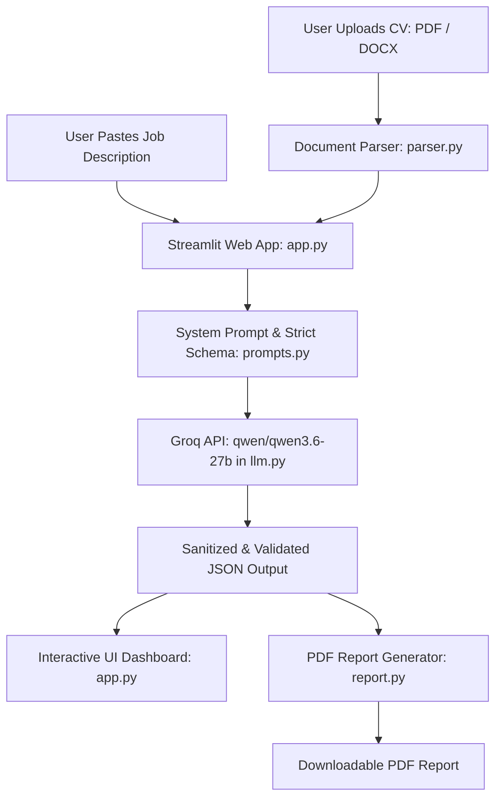

# 🎯 AI Placement Copilot

[](https://www.python.org/)
[](https://streamlit.io/)
[](https://groq.com/)
[](LICENSE)

An intelligent, AI-powered placement preparation copilot that analyzes a candidate's CV against any target Job Description (JD). It delivers evidence-based job-fit scoring, skill gap analysis, personalized CV improvement recommendations, a 7-day tailored interview preparation plan, curated interview questions, and a downloadable executive PDF report.

---

## 🌟 Key Features

- 📄 **Multi-Format CV Parsing**: Upload your resume in **PDF** or **DOCX** format with automatic text extraction.
- 🎯 **Evidence-Based Scoring**: Objective 0–100% alignment score evaluated across 5 key pillars:
  - Technical Skills
  - Functional Skills
  - Relevant Experience
  - Project Alignment
  - Education & Certifications
- 🔍 **In-Depth Alignment Breakdown**:
  - 🟢 **Strong Matches**: Demonstrated skills directly matching the job requirements.
  - 🟡 **Partial Matches**: Transferable or related skills needing reinforcement.
  - 🔴 **Skill Gaps**: Missing qualifications or tools that the candidate should acquire.
- 🏆 **Best Project Spotlight**: Identifies the single most relevant project from your CV, explains why it aligns, and highlights specific interview talking points.
- 📅 **7-Day Preparation Plan**: Day-by-day roadmap tailored to bridge identified gaps before the interview.
- 🎤 **Curated Interview Questions**: Targeted interview questions divided into:
  - HR & Cultural Fit
  - Technical Questions
  - CV-Based Probing Questions
  - Project-Based In-Depth Questions
  - Behavioral / STAR Method Questions
- 📥 **Downloadable PDF Report**: Generate a formatted, publication-ready PDF report with tables, metrics, and interview guidelines using ReportLab.

---

## 🏗️ Architecture & Workflow



---

## 📂 Project Structure

```text
AI-Placement-Copilot/
├── app.py              # Streamlit application UI and user workflow
├── parser.py           # Document extraction logic for PDF (PyMuPDF) and DOCX (python-docx)
├── prompts.py          # Grounded system prompt & strict JSON response schema
├── llm.py              # Groq API client orchestration (qwen/qwen3.6-27b) with fallbacks
├── report.py           # ReportLab PDF report generation engine
├── requirements.txt    # Project dependencies
├── .env.example        # Environment variables template
├── .gitignore          # Git ignore rules for venv, .env, and caches
└── README.md           # Documentation and setup instructions
```

---

## ⚙️ Prerequisites

- **Python**: Version `3.10` or higher installed on your system.
- **Groq API Key**: A free API key from [GroqCloud Console](https://console.groq.com/keys).

---

## 🚀 Local Setup & Installation

Follow these step-by-step instructions to run the application on your local machine:

### 1. Clone the Repository

```bash
git clone https://github.com/your-username/AI-Placement-Copilot.git
cd AI-Placement-Copilot
```

### 2. Create a Virtual Environment

It is recommended to use an isolated Python virtual environment:

**On Windows (PowerShell / Command Prompt):**
```powershell
python -m venv venv
```

**On macOS / Linux:**
```bash
python3 -m venv venv
```

### 3. Activate the Virtual Environment

**On Windows (PowerShell):**
```powershell
.\venv\Scripts\Activate.ps1
```
> *Note for PowerShell users*: If you see a script execution policy error, run:
> `Set-ExecutionPolicy -Scope Process -ExecutionPolicy Bypass` and then run the activation script again.

**On Windows (Command Prompt):**
```cmd
.\venv\Scripts\activate.bat
```

**On macOS / Linux:**
```bash
source venv/bin/activate
```

### 4. Install Dependencies

Install all required packages from `requirements.txt`:

```bash
pip install -r requirements.txt
```

### 5. Configure Environment Variables

Create your local `.env` file from the provided `.env.example`:

**On Windows (PowerShell):**
```powershell
Copy-Item .env.example .env
```

**On Windows (Command Prompt) / macOS / Linux:**
```bash
cp .env.example .env
```

Open the newly created `.env` file in your text editor and add your Groq API key:

```env
GROQ_API_KEY=gsk_your_actual_groq_api_key_here
```

> **Tip**: You can also enter or update your Groq API key directly in the sidebar inside the Streamlit app interface!

### 6. Run the Application

Start the Streamlit development server:

```bash
streamlit run app.py
```

Once started, the application will automatically open in your default browser at:
```
http://localhost:8501
```

---

## 🔑 Obtaining a Free Groq API Key

1. Navigate to [GroqCloud Console](https://console.groq.com/).
2. Sign in or create a free account.
3. In the left navigation menu, select **API Keys**.
4. Click **Create API Key**, give it a name, and copy the generated key (starts with `gsk_`).
5. Paste this key into your `.env` file or into the Streamlit app's sidebar.

---

## 💡 How to Use

1. **Upload Resume**: Click on the left panel file uploader and select your CV in **PDF** or **DOCX** format.
2. **Paste Job Description**: Copy the complete job posting and paste it into the **Job Description** textarea on the right.
3. **Configure API Key**: Ensure your API key is in `.env` or paste it in the left sidebar under **Configuration**.
4. **Analyze**: Click the **🚀 Analyze My CV** button.
5. **Review Results**:
   - Examine overall score and categorical breakdown.
   - Review strong matches, partial matches, and gaps.
   - Inspect the recommended best project and talking points.
   - Follow the personalized 7-day preparation roadmap.
   - Practice the categorized interview questions.
6. **Download Report**: Click **📥 Download Complete PDF Report** to save a copy locally.

---

## 🛠️ Troubleshooting

- **Error: `GROQ_API_KEY is missing`**:
  Make sure you created a `.env` file in the root directory with `GROQ_API_KEY=gsk_...` or enter the key directly in the sidebar inside the app.
- **PowerShell `cannot be loaded because running scripts is disabled`**:
  Run `Set-ExecutionPolicy -Scope Process -ExecutionPolicy Bypass` in your PowerShell terminal, then re-run `.\venv\Scripts\Activate.ps1`.
- **PyMuPDF Installation Issue**:
  Ensure you are using Python 3.10–3.12 and update pip with `python -m pip install --upgrade pip` before installing `requirements.txt`.
- **Port 8501 already in use**:
  You can run Streamlit on an alternate port:
  ```bash
  streamlit run app.py --server.port 8502
  ```

---

## 📜 License

This project is open source and available under the [MIT License](LICENSE).